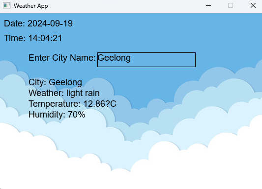

# How to Create a Weather Application Using SplashKit

In this tutorial, I will guide you through creating a weather application using **SplashKit** in **C#**. I'll also show you how to incorporate a background image and properly style the input/output fields.

By the end of this tutorial, you'll have a fully functional weather app that fetches data from OpenWeatherMap and displays it in a visually appealing window.

## Step 1: Setting up SplashKit and Dependencies

Make sure you have installed **SplashKit** and **Newtonsoft.Json** to handle JSON parsing. Here's how you can install it:

### Install SplashKit in your C# project:

- Refer to the [SplashKit](https://splashkit.io/installation/windows-msys2/) documentation to install it properly for your environment.

### Install Newtonsoft.Json via NuGet:

- You can install it using the following command:
```bash
dotnet add package Newtonsoft.Json
```
This package will help you parse the weather data returned from the API.

## Step 2: Creating the Window 
Let's start by creating the main window for our weather application. The size of the window will be for a **540x360** background image.

### Window Code Example
```csharp 
using SplashKitSDK; 

public class Program { 
    public static void Main() { 
        Window window = new Window("Weather App", 540, 360); 
    }
}
```
This opens a new window where we'll display the background and weather data.


## Step 3: Adding a Background Image

Next, we'll add a background image with the dimensions **540x360**. You can change the size of your window according to the size of your background image.

### Code to Add Background Image

```csharp
Bitmap background = new Bitmap("background", "background.jpg");
window.DrawBitmap(background, 0, 0);
```
Ensure the image is placed in the correct directory so it loads properly. You need to place the image in the **images** file in the **Resources** section. Run the following command in your project directory to generate the resources folder.

```bash
skm  resources
```
This command creates sub-folders for each type of resource. One of these is named `images` and that is where we place our image files.

## Step  4: **Input and Output Fields**

To collect city input and display weather data, let's define two areas for input and output.

```csharp
Rectangle inputRect = SplashKit.RectangleFrom(200.0, 50.0, 200.0, 30.0);
Rectangle outputRect = SplashKit.RectangleFrom(50.0, 120.0, 440.0, 200.0);
```
Here, we've positioned the rectangles to fit within the smaller background image.

## Step 5: **Fetching Weather Data**

We are using the [OpenWeather](https://openweathermap.org/) API to fetch the weather data. First you need to create an account and generate an API key. 

### How to use the API key to fetch data

Store your API key in a variable.
```csharp
string apiKey = "4xxxxxxxxxxxxxxxxxxxe";
```

We'll use the **HttpClient** to fetch weather data based on user input. Here's the code for it:

```csharp 
private static readonly HttpClient client = new HttpClient();

string apiURL = $"http://api.openweathermap.org/data/2.5/weather?q={cityName}&appid={apiKey}&units=metric"; 
string response = client.GetStringAsync(apiURL).Result;
```

### How to extract the fetched data

The response we receive from the API is in JSON format. We need to parse the JSON response and extract what we want to display on the screen. This is where we use **Newtonsoft** JSON package. 

```csharp
JObject weatherData = JObject.Parse(response);

string description = weatherData["weather"][0]["description"].ToString();
double temperature = double.Parse(weatherData["main"]["temp"].ToString());
int humidity = int.Parse(weatherData["main"]["humidity"].ToString());
```

## Step 6: Displaying Data

We need to take the city name from the user as an input.

```csharp
private static string weatherInfo = "Enter city and press Enter";
private static string cityName = "unknown";
```
We will use the following font for our weather app.
```csharp
Font font = new Font("input", "arial.ttf");
```

We can use the **StartReadingText** method from Splashkit to start reading text in the rectangle area. We need to show the data that the user is typing in the text box area we created earlier. 

```csharp
if (SplashKit.MouseClicked(MouseButton.LeftButton)) {
    SplashKit.StartReadingText(inputRect);
}

if (SplashKit.ReadingText()) {
    SplashKit.DrawCollectedText(Color.Black, font, 18, SplashKit.OptionDefaults());
}
```
What we're doing here is checking whether the user have clicked inside the window. If yes, we start reading text and display them inside the text box.

Then we can use the following logic to check whether the user has finished entering their data, and if yes use that to fetch the weather data. 

```csharp
if (!SplashKit.ReadingText()) {
    // Check if the text input was cancelled
    if (SplashKit.TextEntryCancelled()) {
        cityName = "unknown";
    } else {
        // Get the city name from the text input
        cityName = SplashKit.TextInput();

        // Fetch weather info if the city name is not empty
        if (!string.IsNullOrEmpty(cityName)) {
            weatherInfo = FetchWeather(cityName, apiKey);
        }
    }
}
```
In this code, the code we used to fetch weather data in step 5, is in a function called **FetchWeather()** that takes two arguments - city name and the API key and returns the fetched data in this format.

```csharp
return $"Weather: {description}\nTemperature: {temperature}°C\nHumidity: {humidity}%";
```
We can now display the data on the output textbox area. 

```csharp
window.DrawText($"City: {cityName}", Color.Black, font, 18, outputRect.X + 10, outputRect.Y + 10); 
window.DrawText(weatherInfo, Color.Black, font, 18, outputRect.X + 10, outputRect.Y + 50);
```

To add the current date and the time, we can use the following code.
```csharp
DateTime currentTime = DateTime.Now;
string dateString = currentTime.ToString("yyyy-MM-dd");
string timeString = currentTime.ToString("HH:mm:ss");

window.DrawText("Date: " + dateString, Color.Black, font, 18, 10, 10);
window.DrawText("Time: " + timeString, Color.Black, font, 18, 10, 40);
```
## Step 7: Run the Program

Save your code and use the following commands to build and run your program.
```bash
skm dotnet build
skm dotnet run
```




## Conclusion 
In this tutorial, you learned how to create a weather app using SplashKit. You added a background image, handled user input, fetched real-time weather data from an API and parsed the JSON data, and displayed the information in a styled window. Feel free to customize the appearance further or add new features!
